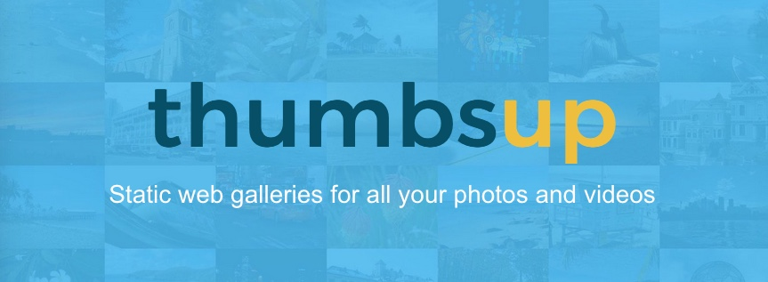
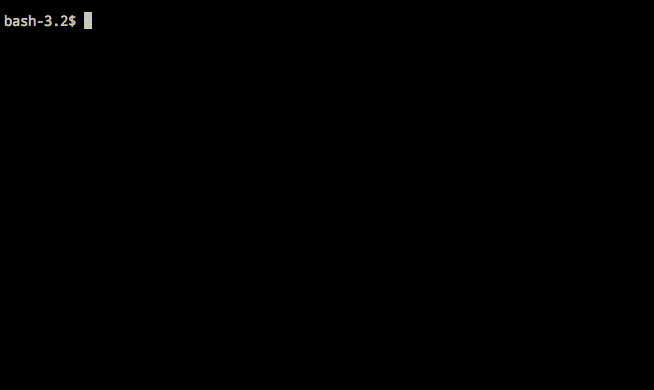

# thumbsup

<!-- Project info -->
[](https://npmjs.org/package/thumbsup)
[](https://github.com/thumbsup/thumbsup)
[](http://standardjs.com/)

<!-- Build status and code analysis -->


<!-- Social sharing -->
[](https://twitter.com/intent/tweet?text=Need%20static%20photo%20and%20video%20galleries?%20Check%20out%20Thumbsup%20on%20Github&url=https://github.com/thumbsup/thumbsup&hashtags=selfhosted,static,gallery)
[](https://www.linkedin.com/shareArticle?mini=true&url=https://github.com/thumbsup/thumbsup&title=Static%20gallery%20generator&summary=Thumbsup%20is%20a%20command-line%20friendly%20static%20gallery%20generator%20for%20all%20your%20photos%20and%20videos&source=Github)
[](https://www.facebook.com/sharer.php?u=https://github.com/thumbsup/thumbsup)

---

<p align="center">https://thumbsup.github.io</p>


---

Turn any folder with photos &amp; videos into a web gallery.

- thumbnails & multiple resolutions for fast previews
- mobile friendly website with customisable themes
- only rebuilds changed files: it's fast!
- detects moved/reorganised files and directories — thumbnails and AI caches follow the move, no re-indexing needed
- uses relative paths so you can deploy the pages anywhere
- works great with Amazon S3 for static hosting

> **This is a fork** of [thumbsup](https://github.com/thumbsup/thumbsup)
> (MIT-licensed, © Romain Prieto). It adds opt-in AI captions, OCR, hybrid
> full-text + semantic search, source-file move detection, a pinned
> Docker image, and a few smaller polish fixes. With no new flags set it
> behaves identically to upstream.
>
> The `themes/classic/` folder is a fork of
> [@thumbsup/theme-classic](https://github.com/thumbsup/theme-classic),
> also MIT-licensed, with small modifications (filename in the lightbox
> caption, a "Search" link in the header).
>
> Both upstream projects' `LICENSE` files are preserved unchanged in this
> tree. See [FORK.md](FORK.md) for the full list of new CLI flags,
> Docker usage, and setup instructions.

## Quick start

Simply point `thumbsup` to a folder with photos &amp; videos. All nested folders become separate albums.

```bash
npm install -g thumbsup
thumbsup --input ./photos --output ./gallery
```



There are many command line arguments to customise the output.
See the website for the full documentation: https://thumbsup.github.io.

## Sample gallery

See a sample gallery online at https://thumbsup.github.io/demos/themes/mosaic/


## Requirements

Thumbsup requires the following dependencies:
- [Node.js](http://nodejs.org/): `brew install node`
- [exiftool](http://www.sno.phy.queensu.ca/~phil/exiftool/): `brew install exiftool`
- [GraphicsMagick](http://www.graphicsmagick.org/): `brew install graphicsmagick`

And optionally:
- [FFmpeg](http://www.ffmpeg.org/) to process videos: `brew install ffmpeg`
- [Gifsicle](http://www.lcdf.org/gifsicle/) to process animated GIFs: `brew install gifsicle`
- [dcraw](https://www.cybercom.net/~dcoffin/dcraw/) to process RAW photos: `brew install dcraw`
- [ImageMagick](https://imagemagick.org/) for HEIC support (needs to be compiled with `--with-heic`)

You can run thumbsup as a Docker container ([ghcr.io/thumbsup/thumbsup](https://github.com/thumbsup/thumbsup/pkgs/container/thumbsup)) which pre-packages all the dependencies above. Read the [thumbsup on Docker](https://thumbsup.github.io/docs/2-installation/docker/) documentation for more detail.

```bash
docker run -v `pwd`:/work ghcr.io/thumbsup/thumbsup [...]
```

## Command line arguments

```
thumbsup [required] [options]
thumbsup --config config.json
```

### Required

| Flag | Description | Type |
|---|---|---|
| `--input` | Path to the folder with all photos/videos | string, required |
| `--output` | Output path for the static website | string, required |

### Input options

| Flag | Description | Default |
|---|---|---|
| `--scan-mode` | How files are indexed (`full`, `partial`, `incremental`) | `full` |
| `--include-photos` | Include photos in the gallery | `true` |
| `--include-videos` | Include videos in the gallery | `true` |
| `--include-raw-photos` | Include raw photos in the gallery | `false` |
| `--include` | Glob pattern of files to include | |
| `--exclude` | Glob pattern of files to exclude | |

### Output options

| Flag | Description | Default |
|---|---|---|
| `--thumb-size` | Pixel size of the square thumbnails | `120` |
| `--small-size` | Pixel height of the small photos | `300` |
| `--large-size` | Pixel height of the fullscreen photos | `1000` |
| `--photo-quality` | Quality of the resized/converted photos | `90` |
| `--video-quality` | Quality of the converted video (percent) | `75` |
| `--video-bitrate` | Bitrate of the converted videos (e.g. `120k`) | |
| `--video-format` | Video output format (`mp4`, `webm`) | `mp4` |
| `--video-hwaccel` | Use hardware acceleration, requires `--video-bitrate` (`none`, `vaapi`) | `none` |
| `--video-stills` | Where the video still frame is taken (`seek`, `middle`) | `seek` |
| `--video-stills-seek` | Number of seconds where the still frame is taken | `1` |
| `--photo-preview` | How lightbox photos are generated (`resize`, `copy`, `symlink`, `link`) | `resize` |
| `--video-preview` | How lightbox videos are generated (`resize`, `copy`, `symlink`, `link`) | `resize` |
| `--photo-download` | How downloadable photos are generated (`resize`, `copy`, `symlink`, `link`) | `resize` |
| `--video-download` | How downloadable videos are generated (`resize`, `copy`, `symlink`, `link`) | `resize` |
| `--link-prefix` | Path or URL prefix for "linked" photos and videos | |
| `--cleanup` | Remove any output file that's no longer needed | `false` |
| `--concurrency` | Number of parallel parsing/processing operations | CPU count |
| `--output-structure` | File and folder structure for output media (`folders`, `suffix`) | `folders` |
| `--gm-args` | Custom image processing arguments for GraphicsMagick | |
| `--watermark` | Path to a transparent PNG to be overlaid on all images | |
| `--watermark-position` | Position of the watermark (`Repeat`, `Center`, `NorthWest`, `North`, `NorthEast`, `West`, `East`, `SouthWest`, `South`, `SouthEast`) | |

### Album options

| Flag | Description | Default |
|---|---|---|
| `--albums-from` | How files are grouped into albums | `["%path"]` |
| `--sort-albums-by` | How to sort albums (`title`, `start-date`, `end-date`) | `start-date` |
| `--sort-albums-direction` | Album sorting direction (`asc`, `desc`) | `asc` |
| `--sort-media-by` | How to sort photos and videos (`filename`, `date`) | `date` |
| `--sort-media-direction` | Media sorting direction (`asc`, `desc`) | `asc` |
| `--home-album-name` | Name of the top-level album | `Home` |
| `--album-page-size` | Max number of files displayed on a page | |
| `--album-zip-files` | Create a ZIP file per album | `false` |
| `--include-keywords` | Keywords to include in `%keywords` | |
| `--exclude-keywords` | Keywords to exclude from `%keywords` | |
| `--include-people` | Names to include in `%people` | |
| `--exclude-people` | Names to exclude from `%people` | |
| `--album-previews` | How previews are selected (`first`, `spread`, `random`) | `first` |

### Website options

| Flag | Description | Default |
|---|---|---|
| `--index` | Filename of the home page | `index.html` |
| `--albums-output-folder` | Output subfolder for HTML albums (default: website root) | `.` |
| `--theme` | Name of a built-in gallery theme (`classic`, `cards`, `mosaic`, `flow`) | `classic` |
| `--theme-path` | Path to a custom theme | |
| `--theme-style` | Path to a custom LESS/CSS file for additional styles | |
| `--theme-settings` | Path to a JSON file with theme settings | |
| `--title` | Website title | `Photo album` |
| `--footer` | Text or HTML footer | |
| `--google-analytics` | Code for Google Analytics tracking | |
| `--embed-exif` | Embed the EXIF metadata for each image into the gallery page | `false` |
| `--locale` | Locale for regional settings like dates | `en` |
| `--seo-location` | Location where the site will be hosted (enables `sitemap.xml` and `robots.txt`) | |

### AI options

| Flag | Description | Default |
|---|---|---|
| `--ai-describe` | Generate a BLIP caption for every image (local, no network) | `false` |
| `--ai-ocr` | Run OCR on every image and index the text for search | `false` |
| `--ai-python` | Python executable used to run `scripts/ai_describe.py` | `python3` |
| `--ai-blip-model` | HuggingFace model id for BLIP captioning | `Salesforce/blip-image-captioning-base` |
| `--ai-ocr-engine` | OCR backend (`easyocr`, `tesseract`). EasyOCR is GPU-capable (CUDA when available, CPU fallback). Tesseract is CPU-only with a lighter Python install. | `easyocr` |
| `--ai-embed` | Generate sentence-transformer embeddings of (caption + OCR) and ship them with the search index. Adds semantic search on top of BM25 keyword search, blended via Reciprocal Rank Fusion. | `false` |
| `--ai-embed-model` | Sentence-transformer model id. Must have a Xenova ONNX export available for client-mode browser embedding. | `sentence-transformers/all-MiniLM-L6-v2` |

### Search options

| Flag | Description | Default |
|---|---|---|
| `--search-mode` | How the search page queries its index. `client` ships a prebuilt MiniSearch index to the browser (fully static). `server` builds a Whoosh index and needs a running Python server. | `client` |
| `--search-python` | Python executable used to build the Whoosh index (server mode only) | `python3` |
| `--search-build-procs` | Whoosh: number of parallel indexing processes (server mode only) | `1` |
| `--search-build-multisegment` | Whoosh: skip segment merge on commit. Faster builds for huge galleries; slightly slower searches until you optimize. | `false` |

### Misc options

| Flag | Description | Default |
|---|---|---|
| `--config` | JSON config file (one key per argument) | |
| `--database-file` | Path to the database file | |
| `--log-file` | Path to the log file | |
| `--log` | Print a detailed text log (`default`, `info`, `debug`, `trace`) | `default` |
| `--dry-run` | Update the index, but don't create the media files / website | `false` |

The optional JSON config should contain a single object with one key per argument,
not including the leading `--`. For example: `{ "sort-albums-by": "start-date" }`

## Contributing

We welcome all [issues](https://github.com/thumbsup/thumbsup/issues)
and [pull requests](https://github.com/thumbsup/thumbsup/pulls)!

If you are facing any issues or getting crashes, please try the following options to help troubleshoot:

```bash
thumbsup [options] --log debug
# [16:04:56] media/thumbs/photo-1446822622709-e1c7ad6e82d52.jpg [started]
# [16:04:57] media/thumbs/photo-1446822622709-e1c7ad6e82d52.jpg [completed]

thumbsup [options] --log trace
# [16:04:56] media/thumbs/photo-1446822622709-e1c7ad6e82d52.jpg [started]
# gm "identify" "-ping" "-format" "%[EXIF:Orientation]" [...]
# gm "convert" "-quality" "90" "-resize" "x400>" "+profile" [...]
# [16:04:57] media/thumbs/photo-1446822622709-e1c7ad6e82d52.jpg [completed]
```

If you want to contribute some code, please check out the [contributing guidelines](.github/CONTRIBUTING.md)
for an overview of the design and a run-through of the different automated/manual tests.

## Disclaimer

While a lot of effort is put into testing Thumbsup (over 400 automated tests), the software is provided as-is under the MIT license. The authors cannot be held responsible for any unintended behaviours.

We recommend running Thumbsup with the least appropriate privilege, such as giving read-only access to the source images.
The Docker setup detailed in the documentation follows this advice.
